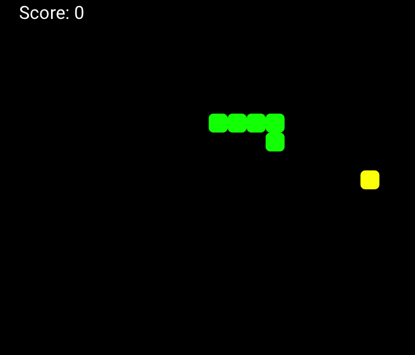

# Snake Game in Python



This is a simple implementation of the classic Snake game in Python using the Pygame library. The game offers a customizable screen mode and the option to choose whether the snake should die when it hits the walls.

## Getting Started

To play the game, follow these steps:

1. Clone this repository to your local machine:

```
git clone https://github.com/your-username/snake-game.git
```

2. Navigate to the project directory:

```
cd snake-game
```


3. Make sure you have Python and Pygame installed on your machine. You can install Pygame using pip:

```
pip install pygame
```

4. Run the game:
```
python main.py
```

## Game Features

- **Customizable Screen Mode:** You can choose between two screen modes: night mode and day mode. Night mode features a black screen with a green snake and a red fruit, while day mode features a white screen with a pink snake and a yellow fruit.

- **Wall Collision:** You have the option to enable or disable wall collision. When wall collision is enabled, the snake will die if it hits the walls. When disabled, the snake will wrap around to the opposite side of the screen.

- **Scoring:** The game keeps track of your score, which increases by 10 points each time the snake eats a fruit.

## Gameplay Instructions

- Use the arrow keys (Up, Down, Left, Right) to control the snake's direction.
- Collect the red fruits to increase your score.
- Avoid running into the walls or the snake's own body, as this will result in a game over.

## Customization

You can customize the game's appearance and behavior by modifying the following variables in the `main.py` file:

- `snake_color`: Change the color of the snake.
- `fruit_color`: Change the color of the fruit.
- `open_wall`: Set to `True` to enable wall collision or `False` to disable it.


## Acknowledgments

This Snake game was created as a fun project to learn Python and Pygame. Feel free to modify and expand upon it as you like. Enjoy playing!
